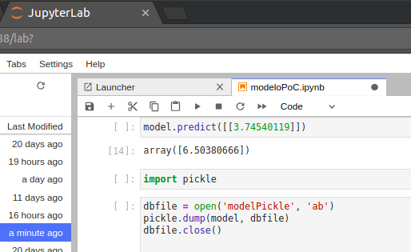
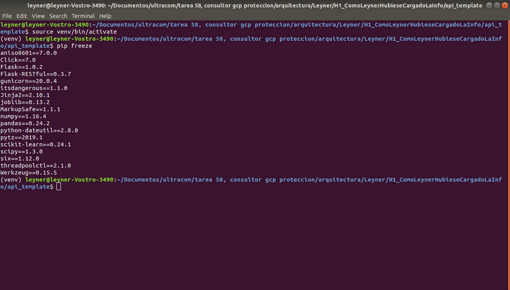
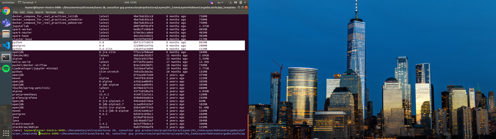
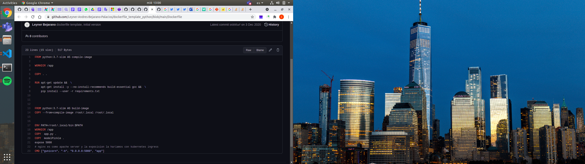
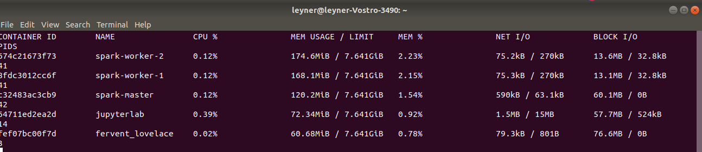

# dockerfile template

Inside this project you will find the notebook where a petal lengh prediction model was created. The cell in the picture below shows prediction done by the model.

### dockerignore

The same way we use gitnore to avoid unnecesary object to arrive to our repository, it's very important that only the necessary object made it to the docker container. This reduce image size and  increase build velocity.

### requirements.txt

An important part of lean docker image is using only the necesesary elements, that includes the python libraries, remember to use virtualenv to separate the libraries that each project needs. Virtual enviroment is activated whan you see the virtual enviroment name at the begining of the command line. Don't upload the venv enviroment to the repository nor pass it to the repo.

## the smallest possible base image

## multi stage build

In the same lane of "only the necesessary objects", we dont really need the code in our container, we need the artifacts created using our code. Something for further improvement would be to do our code pip installable.

## give every container only the resources requerided

In order to use our resources the most eficiently possible (and avoid memory leak) put limits to the amount of resources that every container can access. Use apache Jmeter to determine the resources necessary

